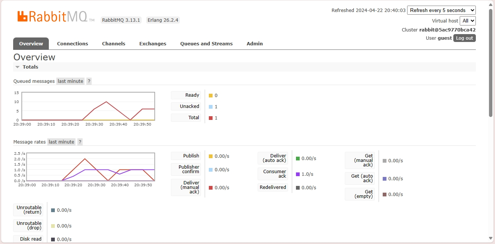

#Reflection 1
1. AMQP adalah Advanced Message Queuing Protocol. AMQP ini merupakan protokol yang memungkinkan berbagai macam aplikasi untuk berkomunikasi secara asinkronus dengan aman. Komunikasi biasaya terjadi antara aplikasi client (yang menerima data) dan aplikasi sumber (yang mengirimkan data). Data dikirimkan menggunakan messaging middleware.

2. Pada ```guest:guest@localhost:5672```, guest pertama merupakan username dan guest kedua merupakan password yang diperlukan untuk proses autentikasi oleh server. localhost merupakan hostname dari server dan namanya seperti itu karena host dari servernya adalah perangkat kita sendiri atau local. Sedangkan 5672 adalah port yang digunakan untuk komunikasi AMQP.

<b> Simulasi slow subscriber </b>

Jumlah message yang ada di queue pada kasus saya ada 10. Hal ini terjadi karena saya menjalan program publisher berulang kali secara cepat dan subscriber belum selesai menerima semua messagenya. Kecepatan mengirimkan pesan menjadi lebih cepat daripada kecepatan menerima pesan. Hal ini menyebabkan message yang menumpuk di queue.