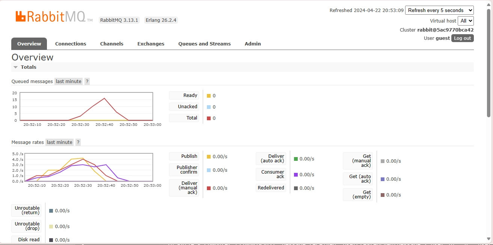
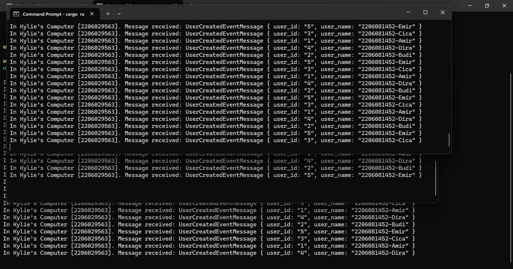

#Reflection 1
1. AMQP adalah Advanced Message Queuing Protocol. AMQP ini merupakan protokol yang memungkinkan berbagai macam aplikasi untuk berkomunikasi secara asinkronus dengan aman. Komunikasi biasaya terjadi antara aplikasi client (yang menerima data) dan aplikasi sumber (yang mengirimkan data). Data dikirimkan menggunakan messaging middleware.

2. Pada ```guest:guest@localhost:5672```, guest pertama merupakan username dan guest kedua merupakan password yang diperlukan untuk proses autentikasi oleh server. localhost merupakan hostname dari server dan namanya seperti itu karena host dari servernya adalah perangkat kita sendiri atau local. Sedangkan 5672 adalah port yang digunakan untuk komunikasi AMQP.

<b> Simulasi slow subscriber </b>

Jumlah message yang ada di queue pada kasus saya ada 10. Hal ini terjadi karena saya menjalan program publisher berulang kali secara cepat dan subscriber belum selesai menerima semua messagenya. Kecepatan mengirimkan pesan menjadi lebih cepat daripada kecepatan menerima pesan. Hal ini menyebabkan message yang menumpuk di queue.

<b>Simulasi multiple subscriber </b>


Dari ketiga console tersebut terlihat bahwa data yang diterima oleh ketiga subscriber beda-beda semua. Hal ini terjadi karena 3 subscriber tersebut merupakan aplikasi yang berbeda-beda. Masing-masing aplikasi akan mengambil data dari message queue dan saat datanya diambil, data itu akan hilang dari message queue, maka data yang sama tidak bisa diambil lagi oleh aplikasi lain. Hal ini membuat message queue berkurang isinya dengan lebih cepat karena banyak aplikasi yang mengambil dan mengosongkan data disitu secara bersamaan, dalam kasus ini 3 data dapat diproses sekaligus dibandingkan sebelumnya yang hanya memproses 1 data dalam 1 waktu. Selain itu, cara lain yang menurut saya dapat meningkatkan performa dari subscriber adalah dengan menggunakan multi threading.